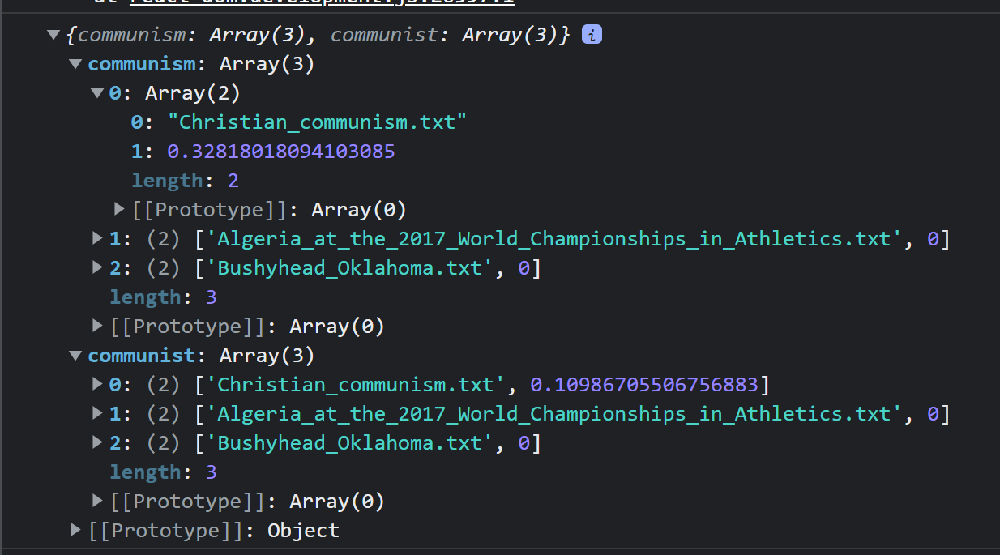

# Search Engine Group Project
#### Mohit Chhaya, Ahaan Kanaujia, Om Chabra, Ayaan Shah

## Objective
The purpose of this project is to create a scalable, performant, general-purpose search engine that can perform queries on user submitted documents. 

## Technical Architecture
The main part of this project is a Flask API that handles running search algorithms on a query. It is sufficiently abstracted enough to the point that an end user only needs to send a query in a `GET` request and the server will return a response containing the most likely documents. 

Below is an example `GET` request to the `/search` endpoint with its corresponding response.




There is an example frontend implemented in React.js that makes simple API calls to the backend for every endpoint. 

### List of Endpoints:
- `/search`
    - Methods: `GET`
    - Parameters: 
        - `query` : string REQUIRED
            - denotes a query to search the document base for
        - `limit` : integer OPTIONAL
            - denotes the total amount of documents to return in the result
        - `searchAlgo` : string OPTIONAL
            - denotes the specific search algorithm to use
            - Value Options:
                - tfidf
                - jaccard
                - ratcliff
- `/uploadDocuments`
    - Methods: `POST`
    - Parameters: 
        - Takes in a list of files encoded as `multipart/form-data` <r> REQUIRED </r>
            - Must be `.txt` files and has a `10mb` size max per file.
- `/currentFiles`
    - Methods: `GET`
    - Parameters:
        - None

## Installation Instructions
#### API Instructions
1. Clone this repository
    ```
        git clone https://github.com/CS222SP22/course-project-mx-a.git
    ```
2. Install dependencies
    ```
        pip install -r requirements.txt -y
    ```
3. Run the API!
    ```
        python .\api.py
    ```

#### React.js Instructions
1. Clone this repository
    ```
        git clone https://github.com/CS222SP22/course-project-mx-a.git
    ```
2. Build React.js app
    ```
        cd frontend && npm build
    ```


## Group Members
- Mohit Chhaya
    - Wrote backend Flask API, Levenshtein similar word generator and sample React.js frontend.
- Ahaan Kanaujia
    - Wrote TF-IDF Search Algorithm and best search algorithm model.
- Om Chabra
    - Wrote Ratcliff-Obershelp Search Algorithm and Levenshtein Distance algorithm.
- Ayaan Shah
    - Wrote Jacaard Index Search Algorithm.